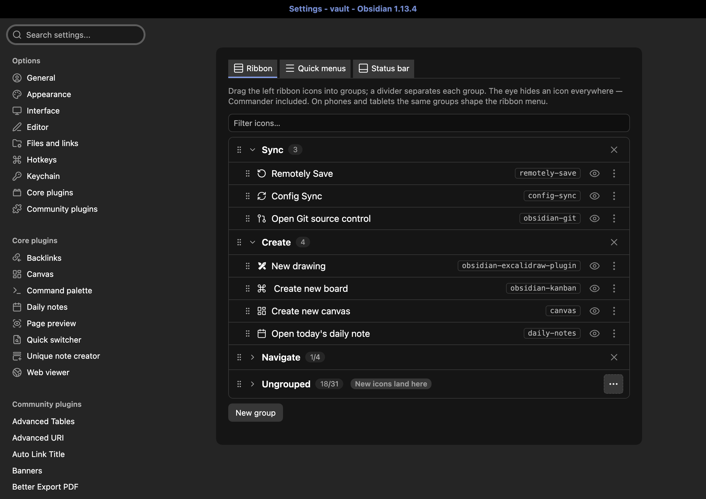
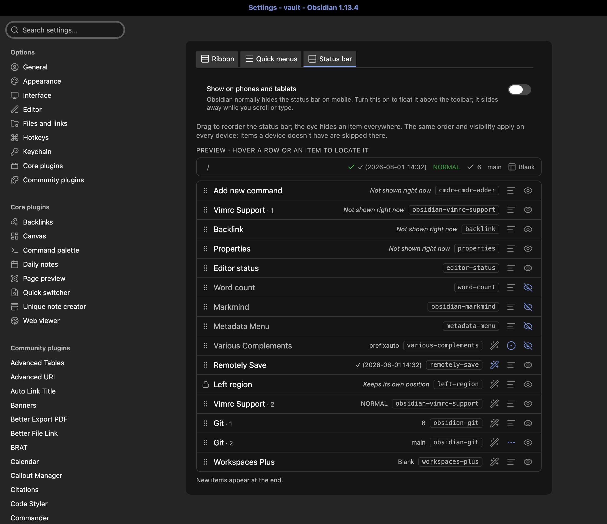

<p align="center"></p>

# Ribbon and Status Bar Organizer

[](https://github.com/xooooooooox/obsidian-ribbon-organizer/releases/latest)
[](https://obsidian.md/plugins?id=ribbon-organizer)
[](./README.md)
[](./README.zh.md)

一个 [Obsidian](https://obsidian.md) 插件:将左侧 ribbon 图标栏整理成命名分组、驯服状态栏,并通过可配置的 ribbon 菜单快速启动命令。



## 功能特性

- **Ribbon 分组** —— 把 ribbon 图标编排进命名分组,分组之间显示一条细分隔线,桌面端、平板和手机均支持。([详情](docs/GUIDE.md#ribbon-groups))
- **收起图标** —— 标记任意 Ungrouped 图标,它就会从 ribbon 移入一个 ⋯ 菜单按钮。([详情](docs/GUIDE.md#ribbon-groups))
- **隐藏图标随处生效** —— 一个眼睛开关会同时写入 Obsidian 原生隐藏和 [Commander](https://github.com/jsmorabito/obsidian-commander) 的隐藏列表,三处 UI 永远保持一致。([注意事项](docs/GUIDE.md#hiding))
- **Quick menus** —— 额外的 ribbon 图标,点开各自的命令列表,标签和图标均可编辑(支持 [Iconize](https://github.com/FlorianWoelki/obsidian-iconize) 图标包)。([详情](docs/GUIDE.md#quick-menus))
- **状态栏排序** —— 把状态栏条目拖拽成自己想要的顺序,隐藏不需要的条目,改动会在所有设备上实时生效。([详情](docs/GUIDE.md#status-bar))
- **收纳吵闹的条目** —— 紧凑与仅图标两种显示模式,以及像 `Successfully synced {time}` → `✓ {time}` 这样的重写规则,还可以添加图标和颜色。([规则](docs/GUIDE.md#rewrite-rules))
- **实时预览** —— 预览条如实映射真实状态栏,悬停设置行、预览条目或状态栏本身,三处会同时高亮同一个条目。
- **手机端状态栏** —— 可选择在手机和平板上以浮动胶囊的形式显示状态栏。
- **诊断** —— "Copy ribbon diagnostics" 命令把 JSON 快照复制到剪贴板,供反馈问题时使用。([详情](docs/GUIDE.md#diagnostics))
- **像笔记一样同步** —— 配置保存在插件的 `data.json` 中,随你使用的 vault 同步方案一起漫游。

## 安装

在 Obsidian 内:**设置 → 第三方插件 → 浏览**,搜索 **Ribbon and Status Bar Organizer**,安装并启用。

测试版:通过 [BRAT](https://github.com/TfTHacker/obsidian42-brat) 添加 `xooooooooox/obsidian-ribbon-organizer`。

## 快速上手

1. 打开 **设置 → Ribbon and Status Bar Organizer → Ribbon**:新建分组并把图标拖进去——ribbon 上相邻非空分组之间会出现分隔线。
2. 点击任意一行的眼睛开关,即可在所有位置隐藏/显示该图标。
3. 切到 **Status bar** 标签页:把条目拖拽成想要的顺序,或点击一条已学习到的状态文本,从中起草一条重写规则。
4. 切到 **Quick menus** 标签页:新建菜单并添加命令——菜单会以独立 ribbon 图标的形式出现。



## 工作原理

- **分组只是视觉层** —— 分组是现有按钮之上的一层展示,从不改动 Obsidian 自身的图标顺序和设置,禁用插件即可恢复原生 ribbon。
- **每个平台两种机制** —— 桌面端和平板直接重排 ribbon 本体;手机端则在导航栏 ribbon 菜单(≡ 按钮)打开的瞬间重排菜单内容。
- **状态栏保留自己的一层** —— 排序、隐藏和重写从不修改其他插件写入的内容,未做任何配置时状态栏与原生状态完全一致。

完整导览——分组、隐藏、quick menus、状态栏标签页、注意事项——都在**[用户指南](docs/GUIDE.md)**中。

## 隐私

插件不联网,也不做任何遥测。配置保存在插件的 `data.json` 中,随你使用的 vault 同步方案漫游;插件为起草规则而学习到的状态文本,则按设计只留在每台设备的 localStorage 中。

## 文档

- **[用户指南](docs/GUIDE.md)** —— 所有行为汇总一处:ribbon 分组、隐藏、quick menus、状态栏标签页、诊断。
- **[架构](docs/ARCHITECTURE.md)** —— 代码地图与不变量,供贡献者参考。

## 开发

```bash
npm install
npm run dev     # watch build
npm test        # vitest
npm run build   # type-check + production bundle
```

请在专用的测试 vault 中开发(切勿使用真实 vault)。

## 许可证

[MIT](LICENSE)
